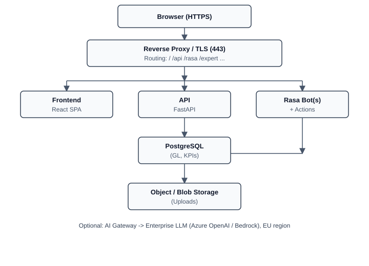

# Finssentials - Architektur Übersicht

## 1. Was ist Finssentials?

**Finssentials** ist eine **webbasierte Finanzanalyse-Plattform** für M&A und Financial Due Diligence:

- **Reporting** auf General-Ledger-Daten (GuV, Bilanz, Cashflow, Working Capital, Sales)
- **Datenaufnahme** (Excel/GDPdU-Upload, Mapping, Versionierung)
- **FDD Bot** — geführter Workflow mit Upload, Konfiguration und Excel-Ausgaben
- Optional: weitere **Chat-Assistenten** (Expert, Exit Readiness)

**Daten:** Finanzdaten und Mandanten-Uploads (Excel) — **vertraulich, GDPR-relevant**. In einer späteren Stage auch **ERP-Daten** (direkte Anbindung).  
**Zielgruppe:** Beratungsteams und deren Mandanten (B2B).

---

## 2. Produktvarianten (bitte im Gespräch klären, welche Variante geplant ist)

| | **Variante A — Vollstack** | **Variante B — Lean (GDPdU / FDD)** |
|---|---------------------------|--------------------------------------|
| **Umfang** | Cockpit, Financials, Sales, Exit Readiness, FDD Bot | Financials, Data Update, Mapping, FDD Bot |
| **Chatbots** | 3× Rasa (FDD + Expert + Readiness) | 1× Rasa (FDD) |
| **Container (ca.)** | 9 Services + Reverse Proxy | 5 Services + Reverse Proxy |
| **Typischer Einstieg** | Produktivbetrieb / größere Teams | Pilot / schlanker Rollout |

Beide Varianten nutzen **dieselbe technische Basis** (React, FastAPI, PostgreSQL, Docker).

---

## 3. Architektur (logisch)

---

## 4. Komponenten-Checkliste

Bitte **Staging + Production** getrennt kalkulieren (2× Umgebung).

| # | Komponente | Anforderung | Hinweis für Kalkulation |
|---|------------|-------------|-------------------------|
| 1 | **PostgreSQL** | Managed, EU (DE/FI/SE), Backups, PITR | Kern-DB; Start ~64–256 GB Storage |
| 2 | **Application Hosting** | Docker Compose oder vergleichbar | Vollstack: **8 vCPU / 32 GB RAM**; Lean: **4 vCPU / 16 GB** |
| 3 | **Frontend** | Static SPA (React build) | Kann auf gleichem Host oder CDN |
| 4 | **Reverse Proxy / TLS** | HTTPS, Routing zu API + Bots | z. B. Caddy, NGINX, App Gateway |
| 5 | **Object Storage** | Uploads & Excel-Outputs | Start ~100–500 GB/Umgebung |
| 6 | **Identity (SSO)** | OIDC / Entra ID, MFA | Für Production |
| 7 | **Secrets** | Vault o. Ä. | DB-Passwörter, API-Keys |
| 8 | **Monitoring & Logs** | Healthchecks, Alerts, Retention 30–90 Tage | `/health`, Rasa `/status` |
| 9 | **Backups & Restore** | DB + ggf. Blob; **Restore-Test** | GDPR / ISO-Vorbereitung |
| 10 | **Netzwerk** | DB nicht öffentlich; Private Endpoints | Firewall / VPN für Admin |
| 11 | **CI/CD-Anbindung** | Pull aus **GitHub Container Registry** | Kein manuelles FTP-Deploy |
| 12 | **Optional: AI** | LLM-Proxy + Enterprise-Endpoint | Keine Roh-Mandantendaten an Public APIs |

---

## 5. Grobe Größenordnung (Start — nicht Maximum)

| Parameter | Planung Annahme |
|-----------|-----------------|
| Interne Nutzer | 10–20 |
| Mandanten / Engagements | 5–15 (Wachstum geplant) |
| Gleichzeitige User | 5–10 |
| FDD-Sessions / Monat | ~200–500 |
| Upload-Größe | typ. 5–50 MB pro Datei |
| Verfügbarkeit | 99,5 %+ (Business Hours zunächst ok) |

---

## 6. Compliance & Standort

| Thema | Anforderung |
|-------|-------------|
| **Datenstandort** | EU (bevorzugt DE, alternativ FI/SE/FR) |
| **AVV / DPA** | Pflicht |
| **GDPR** | Mandantendaten, Lösch-/Retention-Konzept |
| **ISO 27001** | Pfad vorbereiten (nicht zwingend Tag 1 zertifiziert) |
| **Subprozessoren** | Liste + Transparenz |
